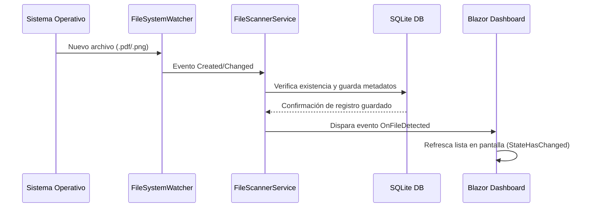

# Arquitectura del Sistema - RikiLoquitoContador

Este documento describe las directrices de diseño y arquitectura de software de la aplicación **RikiLoquitoContador**, construida con .NET 10 y Blazor Hybrid (MAUI).

## Capas del Proyecto

El sistema está organizado bajo un enfoque de **Arquitectura Limpia y Desacoplada**, permitiendo reutilizar el 100% de la lógica y la interfaz de usuario en la aplicación Web y la aplicación de Escritorio (MAUI).

```
RikiLoquitoContador/
├── Config/                    # Archivos de configuración compartida (appsettings.json)
├── docs/                      # Documentación del sistema
├── src/
│   ├── RikiLoquitoContador.Core/       # Lógica de Negocio y Persistencia
│   ├── RikiLoquitoContador.RazorLib/   # Interfaz de Usuario (UI) Compartida
│   ├── RikiLoquitoContador.Web/        # Host ASP.NET Core Blazor Web App
│   └── RikiLoquitoContador.Maui/       # Host de Escritorio/Móvil MAUI Blazor Hybrid
└── test/
    └── RikiLoquitoContador.Tests/      # Pruebas Unitarias e Integración
```

### 1. Capa Core (`RikiLoquitoContador.Core`)
Biblioteca de clases .NET 10 pura. Contiene:
- **Modelos de Datos**: `Factura` (entidad SQLite) y `AppSettings` (tipado de configuración).
- **Acceso a Datos**: `AppDbContext` (Entity Framework Core con SQLite).
- **Servicios**:
  - `ConfigService`: Lee y escribe dinámicamente en `appsettings.json`. Maneja la encriptación de contraseñas con **BCrypt** (coste = 11).
  - `FileScannerService`: Monitorea un directorio en tiempo real con `FileSystemWatcher` y realiza escaneos manuales de facturas.
  - `ExportService`: Exporta datos indexados a formatos CSV, JSON y Excel (ClosedXML incremental).

### 2. Capa de UI Reutilizable (`RikiLoquitoContador.RazorLib`)
Biblioteca de clases de Razor compatible con Web y WebViews nativos de MAUI. Contiene:
- **Internacionalización (i18n)**: Archivo `es.json` embebido y servicio `I18nService` para la centralización de etiquetas.
- **Servicios de Presentación**: `SessionService` para gestionar el inicio y cierre de sesión de forma reactiva.
- **Componentes Razor (MudBlazor)**:
  - `Login.razor`: Pantalla de login premium con vidrio templado (glassmorphism) y validación de contraseña.
  - `Dashboard.razor`: Grilla interactiva, tarjetas de resumen financiero, edición en línea de metadatos y botones de exportación.
  - `Settings.razor`: Formulario para alterar el directorio monitorizado y el intervalo.
  - `MainLayout.razor`: Contenedor principal con sidebar responsivo, alternancia de modo oscuro/claro y guardas de acceso.

### 3. Capas Host (`Web` y `Maui`)
Proyectos de despliegue específicos para cada plataforma. No contienen lógica de negocio; únicamente configuran el contenedor de Inyección de Dependencias (DI), cargan las hojas de estilo de MudBlazor y inician la base de datos local:
- `RikiLoquitoContador.Web`: Servidor web interactivo.
- `RikiLoquitoContador.Maui`: Ejecutable de escritorio nativo (Windows/macOS) que levanta un WebView local rápido.

---

## Flujo de Datos del Escáner en Tiempo Real

El monitoreo de facturas utiliza un flujo de eventos desacoplado y reactivo:


